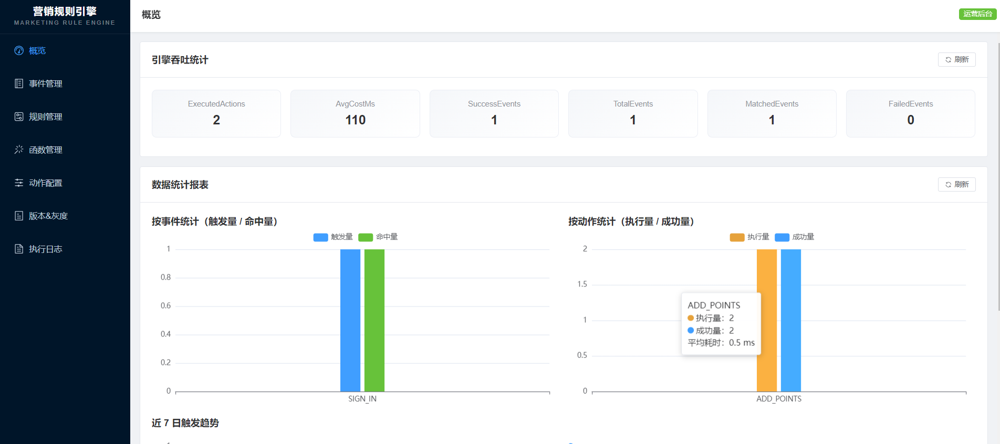
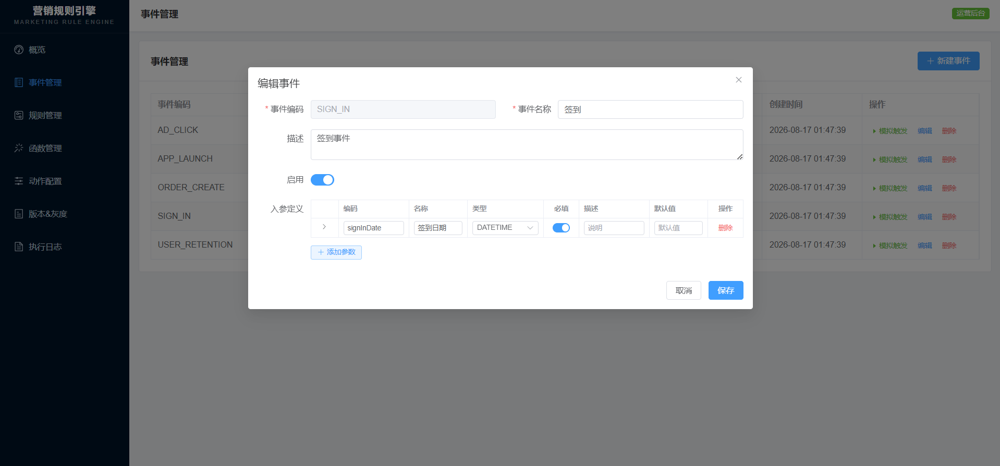
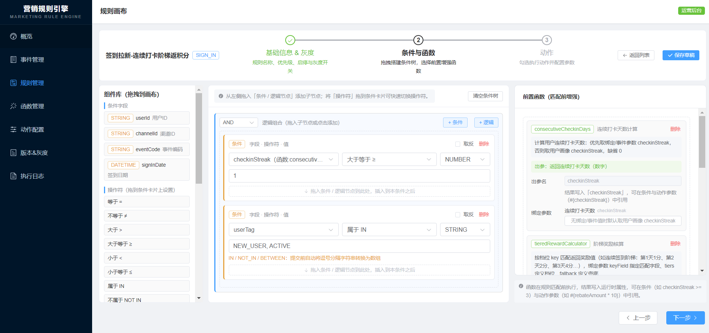
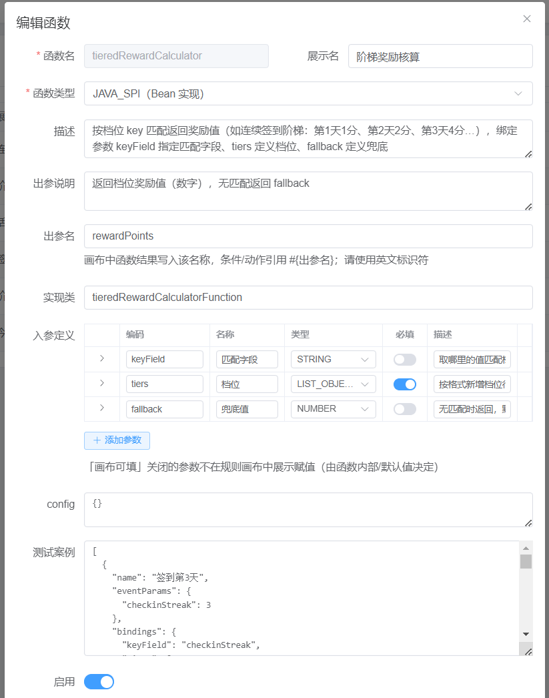
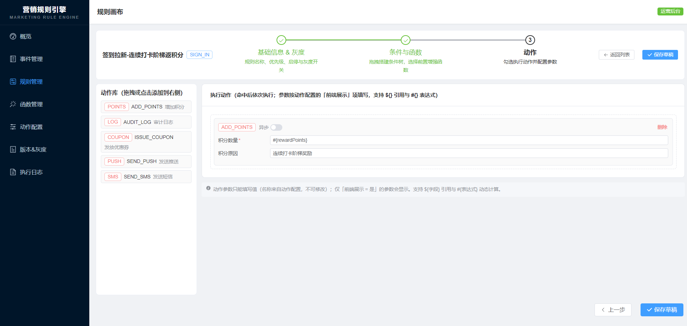
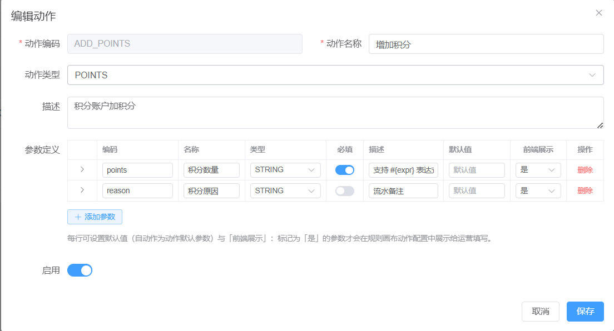

# 营销规则引擎（Marketing Rule Engine）

通用营销规则引擎框架（不绑定具体业务）：围绕 **事件触发 → 规则匹配 → 自定义函数增强 → 营销动作执行** 核心链路设计，
适配广告归因、签到拉新、下单返券、活动分层推送、用户触达等主流营销场景。

- 技术栈：**Java 21 / Spring Boot 3.2 / Spring MVC / MyBatis-Plus / MySQL**，前端 **Vue 3 + Element Plus + ECharts**
- 架构：**DDD 领域分层**（domain / infrastructure / application / interfaces 四模块）
- 设计模式：**模板方法**（引擎骨架）+ **责任链**（四阶段链路）+ **工厂**（执行器/灰度/阶段装配）+ **策略**（操作符/灰度/动作）+ **组合**（条件树）+ **SPI**（表达式/函数/画像/幂等/分发）
- 表达式引擎：默认 **SpEL**；可选 **QLExpress**（`-Pqlexpress`）、**LiteFlow**（`-Pliteflow`，见 docs/qlexpress-liteflow.md）

## 功能总览

| 模块 | 能力 |
|---|---|
| 事件管理 | 维护触发事件（广告点击/下单/签到…），定义入参字段（渠道 id、广告位、用户 id、订单金额、地域、时间）；支持**事件模拟触发**（按入参 schema 填值，真实走引擎全链路测试命中与动作，含执行追踪与日志落库） |
| 规则画布 | **分步向导**：①基础信息&灰度 → ②条件与函数 → ③动作；条件树拖拽配置（用户标签/时间区间/行为次数 + 嵌套且/或/非 + 自定义表达式）；前置函数绑定参数、动作"名称-值"参数（按前端展示开关过滤） |
| 自定义函数 | 上传 Jar 包 / 在线编辑脚本 / Java SPI，注册业务函数（连续打卡天数、**签到天数/今日已签到（基于 t_engine_log 真实历史）**、**阶梯奖励/阶梯返利核算**、活跃度计算），支持**在线测试（内置一键案例，可存为案例）**与热更新 |
| 动作配置 | 动作模板 CRUD（券模板、短信模板、积分数量…），每参数可设默认值与**前端展示开关**；内置发券/短信/积分/推送/审计执行器；画布直接添加的动作自动注册 |
| 版本&灰度 | 版本回溯、按渠道/用户分桶灰度开关、上下线，热更新秒级生效；列表展示最新版本号 |
| 运行时 | 高并发事件吞吐（本地缓存 + 纯内存匹配 + 动作异步化 + 幂等去重）；执行日志/动作明细/增强属性全量落 MySQL，**统计报表（ECharts）**与吞吐统计实时数据库聚合 |

## 界面预览

管理后台实际页面截图（图片位于 `docs/images/`）：

<table>
  <tr>
    <td width="50%" align="center"><b>概览 · 统计报表（ECharts 实时聚合 MySQL）</b></td>
    <td width="50%" align="center"><b>事件管理 · 入参 schema 编辑</b></td>
  </tr>
  <tr>
    <td align="center"></td>
    <td align="center"></td>
  </tr>
  <tr>
    <td width="50%" align="center"><b>规则画布 · 条件树 + 函数 + 动作分步向导</b></td>
    <td width="50%" align="center"><b>自定义函数 · 在线编辑 + 一键测试</b></td>
  </tr>
  <tr>
    <td align="center"></td>
    <td align="center"></td>
  </tr>
  <tr>
    <td width="50%" align="center"><b>动作配置 · 模板列表</b></td>
    <td width="50%" align="center"><b>动作编辑 · 参数默认值 + 前端展示开关</b></td>
  </tr>
  <tr>
    <td align="center"></td>
    <td align="center"></td>
  </tr>
</table>

## 快速开始

```bash
# 0) 准备 MySQL（5.7+ / 8.x），账号需具备建库权限（连接串已带 createDatabaseIfNotExist=true，库不存在会自动创建）
#    默认连接参数见 rule-engine-web/src/main/resources/application.yml 的 spring.datasource.*（默认 root / 127.0.0.1:3306 / rule_engine）
mysql -uroot -p -e "CREATE DATABASE IF NOT EXISTS rule_engine DEFAULT CHARACTER SET utf8mb4;"   # 可选，驱动也能自动创建

# 1) 后端构建（离线机器使用本地仓库：-o -llr）
mvn -o -llr package -DskipTests
java -jar rule-engine-web/target/rule-engine-web-1.0.0.jar
# 启动时自动执行 schema.sql（建表） + data.sql（初始化数据：5 事件 / 6 函数 / 5 动作 / 8 条已发布规则），幂等可重复执行

# 冒烟：触发事件后查看实时统计（数据来自数据库聚合）
curl http://localhost:8080/api/engine/stats
curl -X POST http://localhost:8080/api/engine/trigger -H "Content-Type: application/json" -d '{"eventCode":"ORDER_CREATE","userId":"u1","channelId":"APP","params":{"orderId":"O1","orderAmount":800}}'

# 事件模拟触发（页面测试：真实走引擎全链路并落库，返回规则追踪与动作明细）
curl -X POST http://localhost:8080/api/engine/simulate -H "Content-Type: application/json" -d '{"eventCode":"SIGN_IN","userId":"u1","channelId":"APP","params":{"signInDate":"2026-08-16 10:00:00"}}'

# 2) 一键全量初始化（可选）：重建 rule_engine 库（建库 + 建表 + 初始化数据）
mysql -uroot -p < sql/mysql-init.sql

# 3) 前端（需联网环境安装依赖，含 echarts）
cd rule-engine-admin-ui
npm install
npm run dev        # http://localhost:5173，/api 已代理到 8080
```

> 数据全部存储于 MySQL：数据库连接参数在 `rule-engine-web/src/main/resources/application.yml` 的 `spring.datasource.*` 中配置；
> 吞吐统计/报表/日志均实时从数据库聚合查询；测试环境使用独立库 `rule_engine_test`（驱动自动创建）执行同一份 `schema.sql` / `data.sql`。

## Docker 部署（一键编排）

提供 `docker-compose.yml` 一键拉起 **MySQL 8 + 后端 Spring Boot + 前端 Vue3/Nginx** 三服务，无需本机预装 Maven / Node / MySQL。

```bash
# 在项目根目录执行
docker compose up -d --build
# 首次构建需联网拉取镜像 + Maven 依赖 + npm 依赖，约 5-10 分钟
# 完成后：
#   - 前端  http://localhost          （Nginx 静态托管 + /api 反代到后端）
#   - 后端  http://localhost:8080     （REST API）
#   - MySQL localhost:3306           （root / 默认密码 tiger）
```

启动顺序：`mysql` 健康检查通过 → `rule-engine-web` 自动建库建表 + 执行 `schema.sql` / `data.sql`（幂等）→ `rule-engine-admin-ui` 启动 Nginx。

常用命令：

```bash
docker compose ps                 # 查看服务状态
docker compose logs -f rule-engine-web   # 跟随后端日志
docker compose down               # 停止并移除容器（数据卷保留）
docker compose down -v            # 同时清空 MySQL 数据卷（彻底重置）
docker compose up -d --build rule-engine-web   # 仅重建并重启后端
```

环境变量覆盖（在根目录 `.env` 文件或 `export` 设置均可）：

| 变量 | 默认值 | 说明 |
|---|---|---|
| `MYSQL_ROOT_PASSWORD` | tiger | MySQL root 密码 |
| `MYSQL_DATABASE` | rule_engine | 业务库名 |
| `MYSQL_PORT` | 3306 | 宿主机映射的 MySQL 端口 |
| `WEB_PORT` | 8080 | 后端宿主机端口 |
| `UI_PORT` | 80 | 前端宿主机端口 |
| `JAVA_OPTS` | （空） | 后端 JVM 参数，如 `-Xms512m -Xmx1024m` |

示例 `.env`：

```
MYSQL_ROOT_PASSWORD=your_pwd_here
WEB_PORT=18080
UI_PORT=8080
JAVA_OPTS=-Xms512m -Xmx1024m
```

部署产物：

- 上传的函数 Jar 持久化到宿主机 `./data/functions`（与 `application.yml` 的 `rule-engine.function-jar-dir` 对应）
- MySQL 数据持久化到 docker 卷 `mysql_data`

> 本地开发可继续使用 `mvn -o -llr package` + `java -jar` + `npm run dev` 的原生方式（见"快速开始"）；`application.yml` 的数据库连接已支持 `${DB_HOST}` / `${DB_USERNAME}` / `${DB_PASSWORD}` 等环境变量覆盖，默认值与本地一致，互不冲突。

## 模块结构

```
marketing-rule-engine/
├── rule-engine-core/           领域层（纯 Java）：引擎/模型/SPI/仓储接口
├── rule-engine-infrastructure/ 基础设施层：MyBatis-Plus 持久化、SpEL、函数加载器、缓存热更新、执行器、日志
├── rule-engine-application/    应用层：事件/规则/函数/动作/引擎应用服务
├── rule-engine-web/            接口层：SpringBoot 启动、REST API、MySQL 初始化 SQL（schema/data）、集成测试
├── rule-engine-ext-qlexpress/  [可选] QLExpress 表达式引擎适配（mvn -Pqlexpress）
├── rule-engine-ext-liteflow/   [可选] LiteFlow 流程编排适配（mvn -Pliteflow）
├── rule-engine-admin-ui/       Vue3 管理前端源码（含 Dockerfile / nginx.conf）
├── docs/                       架构 / 设计模式 / 场景 / API 契约 / 扩展文档
├── docker-compose.yml          一键编排：MySQL 8 + 后端 + 前端 Nginx
├── rule-engine-web/Dockerfile 后端多阶段镜像（Maven 构建 → JRE 运行）
└── .dockerignore               Docker 构建上下文排除项
```

## 核心链路

```
MarketingEvent(事件 / 页面模拟触发)
  → ① 事件归一化（定义校验/画像）
  → ② 函数增强（连续打卡天数、签到天数/今日已签到（t_engine_log）、阶梯奖励/返利…写入运行时属性）
  → ③ 规则匹配（灰度放行 → 条件树递归求值）
  → ④ 动作执行（参数解析 ${} / #{} → 幂等 → 异步分发执行器）
  → EngineResult + 执行日志 / 动作记录 / 增强属性（全量落 MySQL，实时可查）
```

## 文档

- [架构设计](docs/architecture.md)
- [设计模式落地](docs/design-patterns.md)
- [业务场景适配](docs/scenarios.md)
- [API 契约](docs/api-contract.md)
- [QLExpress / LiteFlow 扩展](docs/qlexpress-liteflow.md)

## 测试

```bash
mvn -o -llr test
# 集成测试连接 MySQL 独立库 rule_engine_test（自动创建，schema.sql/data.sql 幂等可重复执行）
# 覆盖：条件树求值（嵌套逻辑/操作符/表达式）、灰度分桶一致性、责任链顺序与中断、
#      动作参数解析、值强转、引擎全链路集成（触发→匹配→增强→动作→日志→幂等→灰度→版本回溯→DB统计→日志明细）
```

## 生产化建议

- 数据库仅使用 MySQL（`spring.datasource.*` 配置连接；`sql/mysql-init.sql` 一键初始化，`schema.sql`/`data.sql` 幂等随应用启动执行）
- 动作执行器对接真实发券/短信/推送/积分通道（实现 `ActionExecutor` SPI 注册即可）
- 用户画像接入真实用户中心（实现 `UserProfileResolver` SPI）
- 幂等存储/分发执行器替换为 Redis / MQ（实现 `IdempotencyStore` / `ActionDispatchExecutor` SPI）
- 高并发场景可将事件入口切换为 Kafka/RocketMQ 消费
